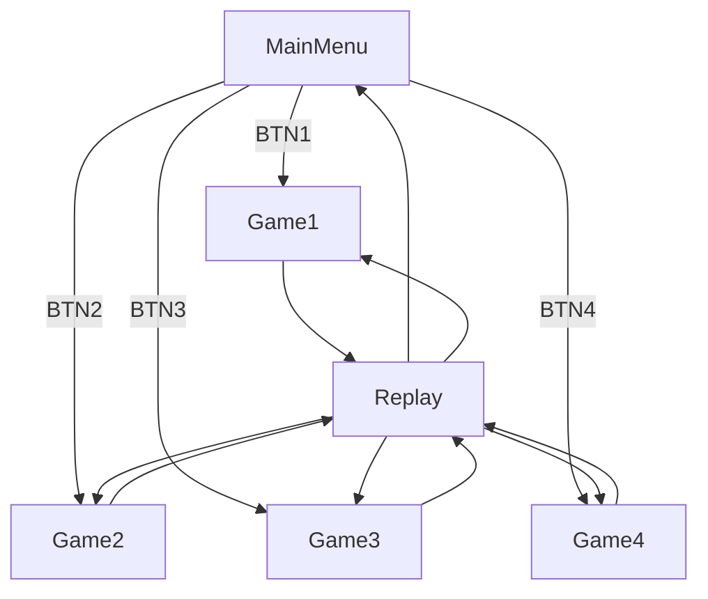
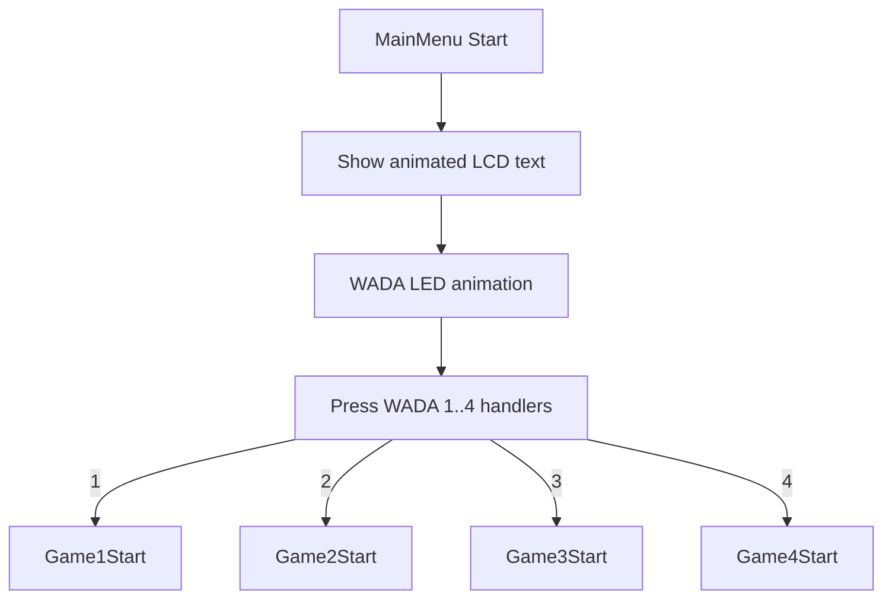
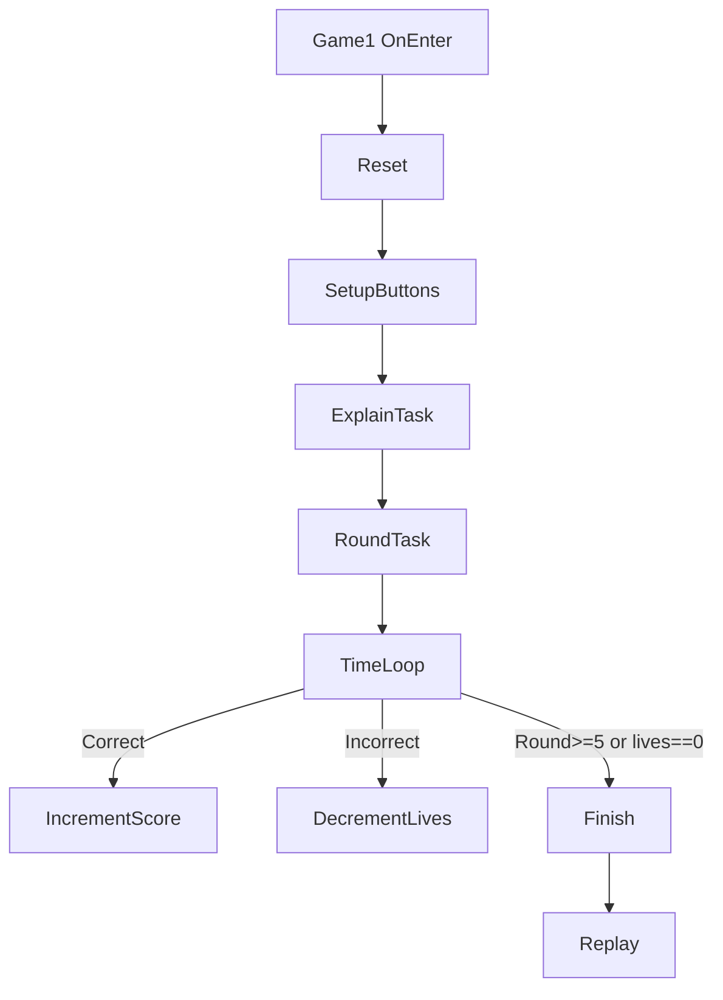
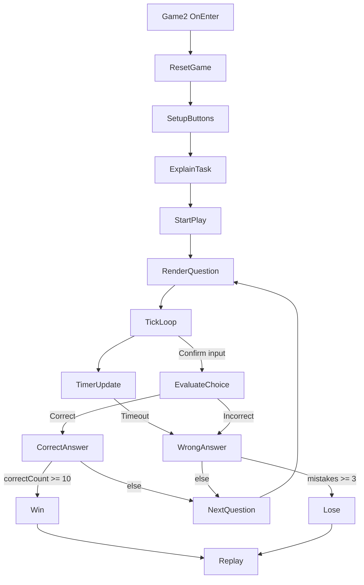
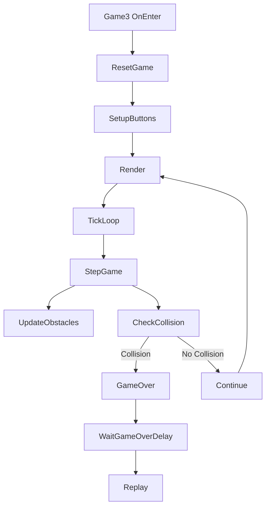
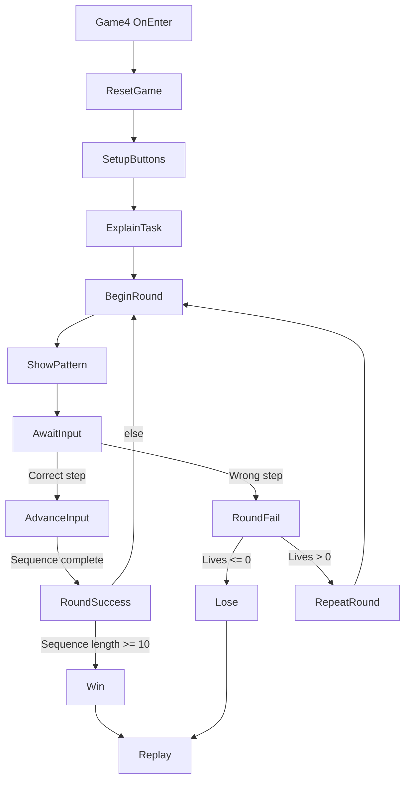

# ArduinoThings Codebase Report

## 1. High-level architecture

- `src/main.cpp` initializes all hardware components, state machine and tasks, then enters Arduino `loop()`.
- States are implemented in `include/States/*.hpp`:
  - `MainMenu` displays options and animates WADA.
  - `Game1` is binary conversion challenge with WADA button input.
  - `Game2` is a timed Katakana-to-romaji quiz with score and lives.
  - `Game3` is lane-avoidance obstacle game.
  - `Game4` is a Simon-style LED memory sequence game.
  - `Replay` handles returning to previously played state.
- `TaskManager` schedules and ticks ongoing coroutines/tasks.
- `StateMachine` manages transitions between states and resets WADA button callback events on transition.

## 2. Pin assignment table

| Component | Class / Object | Arduino pin | Notes |
|---------|----------------|------------|-------|
| User button | `Components::Button *userButton` | `USER_BTN` | external button, custom define from board config or platformio environment (typically `D2` on some boards). |
| WADA module | `Components::WADA *wada` | `D3` (STB), `D4` (CLK), `D5` (DIO) | TM1638 display + 8 buttons + 8 7-seg + 8 LEDs. |
| Built-in LED | `Components::Led *ledBuiltin` | `LED_BUILTIN` | board builtin LED. |
| LCD (I2C) | `Components::Lcd *lcd` | `0x27` I2C addr | 16x2 display (SDA/SCL on board). |
| Potentiometer | `Components::Potentiometer *pot` | `A0` | analog input volume/unused. |
| Buzzer | `Components::Buzzer *buzzer` | `D9` | PWM beep/audio output. |

## 3. Main program flow

1. `setup()`:
   - Initialize `Serial` and `lcd`, load character generator.
   - Play startup melody on `buzzer`.
   - Instantiate states and register with `stateMachine`.
   - Configure allowed transitions.
   - Set initial state to `mainmenu`.
2. `loop()`:
   - `buzzer->Tick()` updates sound voice state.
   - `userButton->Tick()` polls user button (unused in state machine by default).
   - `wada->Tick()` polls TM1638 button states.
   - `tasks.Tick()` runs active tasks (coroutines animations, game loops, etc.).
   - `stateMachine.Tick()` runs current state tick.

## 4. State machine transition diagram (vertical)

## 5. Game-specific behavior summaries

### 5.1 Game1 — binary puzzle
- On enter: `Reset()` sets round, lives, score, target random number and `SetupButtons()`.
- WADA buttons toggle bits on 8-bit answer; button 1 submits with <=1 second remaining.
- `RoundTask` has timer, 4 rounds (1..4), correct/incorrect feedback, score update,
- On complete: show win/lose, go to `replay` state.

### 5.2 Game2 — Katakana reading challenge
- On enter: `ResetGame()` initializes score, lives, timers, and question state; `SetupButtons()` enables option selection and confirmation.
- A random Katakana glyph is displayed with two romaji options; exactly one option is correct.
- Timer-based rounds: first 5 correct answers use 60s limit, then 30s limit for higher pressure.
- Correct answer flow: increase score (`secondsLeft`, or `secondsLeft + 30` in short-timer phase), increment correct count, generate next question.
- Wrong/timeout flow: increment mistakes, play fail tone, generate next question unless mistakes reached max.
- Win condition: `TARGET_CORRECT = 10`; Lose condition: `MAX_MISTAKES = 3`; then transition to `replay` after result delay.

### 5.3 Game3 — obstacle lane runner
- OnEnter resets game and sets up WADA button1 to swap rows.
- `Tick()` handles game over, timed steps (`STEP_DELAY` = 500ms), `StepGame()`, and `Render()`.
- Obstacles spawn on two lanes and move; collision sets game over.
- Score increment for obstacles passing, displayed via WADA number.

### 5.4 Game4 — LED sequence memory puzzle
- On enter: `ResetGame()` clears sequence and lives, `SetupButtons()` maps 8 WADA buttons to sequence inputs.
- Round start (`BeginRound`): optionally appends one new random button to the pattern, then enters playback phase.
- Playback phase (`UpdatePatternPlayback`): game flashes each LED in sequence and plays a corresponding tone before accepting input.
- Input phase (`HandleInput`): each press is validated against current sequence index with immediate feedback.
- On successful sequence repeat: score increases by `sequence_length * 10`; game either starts next longer round or finishes if target length reached.
- On wrong input: lose one life and repeat same sequence length; game ends when lives reach 0.
- Win condition: `TARGET_SEQUENCE_LENGTH = 10`; Lose condition: `MAX_LIVES = 5` exhausted; then transition to `replay`.

## 6. Task management and coroutines
- `Tasks::Task` has `Tick()`, `CoroBegin`, `CoroWait`, `CoroEnd` to simulate cooperative multitasking.
- `TaskManager::Tick()` propagates and cleans finished tasks.

## 7. Component class interactions
- `WADA` contains 8 internal `Button`s with `UpdateState` and uses bitmask from TM1638.
- `Button` uses internal `Debouncer` to avoid bounce and supports edge selection.
- `Buzzer` handles multiple tones with mixing logic and scheduled timers.

## 8. Mermaid game flow detail (vertical, state-by-state)

### 8.1 MainMenu subflow

### 8.2 Game1 internal flow

### 8.3 Game2 internal flow

### 8.4 Game3 internal flow

### 8.5 Game4 internal flow

